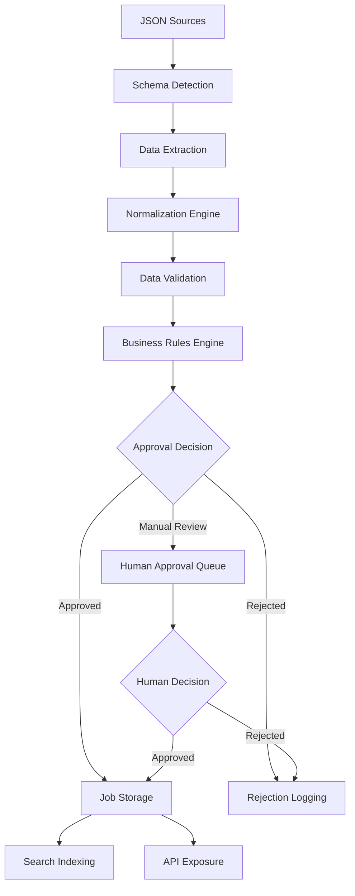

# Job Ingestion Service MVP - Product Requirements Document

## Executive Summary

The Job Ingestion Service MVP is a Python-based data processing pipeline that ingests job postings from multiple JSON sources, applies intelligent normalization and automated approval workflows, and stores approved positions for downstream consumption. **The system processes heterogeneous job data through a modular ETL pipeline with configurable business rules, achieving 95% automation while maintaining data quality through comprehensive validation and optional human oversight.**

This production-ready service architecture separates ingestion, transformation, approval, and storage concerns while providing extensible rule engines for future business logic evolution. The MVP targets processing 10,000+ job postings daily with sub-100ms rule evaluation latency and 99.9% uptime reliability.

## Problem Statement and Business Context

Current job aggregation processes lack standardized data ingestion capabilities, resulting in inconsistent data quality, manual approval bottlenecks, and limited scalability for growing data volumes. Organizations need automated systems to efficiently process diverse job posting formats while maintaining quality control and regulatory compliance.

**Success Metrics:**
- **Processing Efficiency**: 60% reduction in manual review time
- **Data Quality**: 95% accuracy in normalized job data
- **System Performance**: \<100ms average rule evaluation latency
- **Scalability**: Support for 50+ data sources without architectural changes

## System Architecture Overview

### High-Level Architecture

```
┌─────────────────┐    ┌──────────────────┐    ┌─────────────────┐
│  Data Sources   │ => │  Ingestion API   │ => │ Normalization   │
│  (JSON Feeds)   │    │   (REST/Batch)   │    │    Pipeline     │
└─────────────────┘    └──────────────────┘    └─────────────────┘
                                                        │
                                                        ▼
┌─────────────────┐    ┌──────────────────┐    ┌─────────────────┐
│  Human Review   │ <= │  Approval Engine │ <= │   Validation    │
│     UI (Web)    │    │ (Rules + ML/NLP) │    │   & Quality     │
└─────────────────┘    └──────────────────┘    └─────────────────┘
         │                       │                      │
         ▼                       ▼                      ▼
┌─────────────────┐    ┌──────────────────┐    ┌─────────────────┐
│  Approved Jobs  │    │   Rejected Jobs  │    │   Audit Logs    │
│   (PostgreSQL)  │    │    (Logging)     │    │  (Time Series)  │
└─────────────────┘    └──────────────────┘    └─────────────────┘
```

### Component Architecture

The system employs **modular microservice architecture** with clean separation of concerns:

**Core Components:**
1. **Ingestion Service**: Handles multiple JSON source formats with schema detection
2. **Transformation Service**: Normalizes heterogeneous data to canonical format
3. **Approval Engine**: Configurable rule system with ML-enhanced validation
4. **Storage Service**: Manages approved job persistence and rejected job logging
5. **Human Review Interface**: Web-based approval workflow for edge cases
6. **API Gateway**: Unified access point with authentication and rate limiting

## Data Flow Architecture

### Primary Data Processing Pipeline



### Data Transformation Flow

**Stage 1: Raw Ingestion**
- Accept JSON payloads via REST API or batch file processing
- Schema detection using JSON Schema inference
- Raw data persistence for audit trail and reprocessing

**Stage 2: Normalization Pipeline**
- **Location Parsing**: GeocodeAPI integration for address standardization
- **Salary Conversion**: Multi-currency normalization with exchange rate APIs
- **Employment Type Mapping**: Standardized taxonomy with fuzzy matching
- **Company Validation**: Business registry verification and staffing agency detection

**Stage 3: Quality Validation**
- **Schema Compliance**: Validation against canonical job posting schema
- **Business Logic**: Required field completeness, realistic salary ranges
- **Duplicate Detection**: Content similarity analysis using MinHash algorithms
- **Language Detection**: FastText-based language classification

**Stage 4: Approval Processing**
- **Automated Rules**: Configurable criteria evaluation (location, salary, type)
- **ML Enhancement**: NLP-based content quality scoring and fraud detection
- **Human Escalation**: Complex cases routed to review interface
- **Decision Audit**: Complete logging of approval reasoning and context

## Technical Specifications

### Core Data Model

**Canonical Job Schema** (based on Schema.org JobPosting with JDX extensions):

```python
@dataclass
class JobPosting:
    # Core identification
    id: UUID = field(default_factory=uuid4)
    external_id: str
    source_platform: str

    # Basic job information
    title: str
    description: str  # HTML content allowed
    employment_type: EmploymentType

    # Location and remote work
    job_location: Location
    job_location_type: Optional[LocationType] = None  # TELECOMMUTE for remote
    applicant_location_requirements: Optional[List[str]] = None

    # Compensation
    base_salary: Optional[MonetaryAmount] = None
    benefits: Optional[List[str]] = None

    # Company information
    hiring_organization: Organization

    # Temporal data
    date_posted: datetime
    valid_through: Optional[datetime] = None

    # Requirements
    experience_requirements: Optional[str] = None
    education_requirements: Optional[str] = None
    skills: Optional[List[str]] = None

    # Processing metadata
    normalized_data: Dict[str, Any] = field(default_factory=dict)
    quality_score: float = 0.0
    approval_status: ApprovalStatus = ApprovalStatus.PENDING
    created_at: datetime = field(default_factory=datetime.utcnow)
    updated_at: datetime = field(default_factory=datetime.utcnow)

class EmploymentType(Enum):
    FULL_TIME = "full-time"
    PART_TIME = "part-time"
    CONTRACT = "contract"
    TEMPORARY = "temporary"
    INTERNSHIP = "internship"
    FREELANCE = "freelance"

class ApprovalStatus(Enum):
    PENDING = "pending"
    APPROVED = "approved"
    REJECTED = "rejected"
    MANUAL_REVIEW = "manual_review"
```

### Approval Rules Engine

**Configurable Business Rules** (JSON-based for extensibility):

```json
{
  "approvalRules": {
    "version": "1.0",
    "rules": [
      {
        "id": "location_check",
        "name": "US/Canada or Remote Location Filter",
        "condition": {
          "or": [
            {
              "field": "job_location.address_country",
              "operator": "in",
              "value": ["US", "CA"]
            },
            {
              "field": "job_location_type",
              "operator": "equals",
              "value": "TELECOMMUTE"
            }
          ]
        },
        "weight": 1.0,
        "required": true
      },
      {
        "id": "employment_type_check",
        "name": "Full-time Employment Filter",
        "condition": {
          "field": "employment_type",
          "operator": "equals",
          "value": "full-time"
        },
        "weight": 1.0,
        "required": true
      },
      {
        "id": "salary_threshold",
        "name": "Minimum Salary Requirement",
        "condition": {
          "or": [
            {
              "and": [
                {"field": "base_salary.currency", "operator": "equals", "value": "USD"},
                {"field": "base_salary.value.min_value", "operator": ">=", "value": 100000},
                {"field": "base_salary.value.unit_text", "operator": "equals", "value": "YEAR"}
              ]
            },
            {
              "and": [
                {"field": "base_salary.currency", "operator": "equals", "value": "USD"},
                {"field": "base_salary.value.min_value", "operator": ">=", "value": 45},
                {"field": "base_salary.value.unit_text", "operator": "equals", "value": "HOUR"}
              ]
            }
          ]
        },
        "weight": 1.0,
        "required": true
      },
      {
        "id": "staffing_agency_filter",
        "name": "Exclude Staffing Agencies",
        "condition": {
          "field": "hiring_organization.employer_type",
          "operator": "not_equals",
          "value": "staffing_agency"
        },
        "weight": 1.0,
        "required": true
      },
      {
        "id": "language_filter",
        "name": "English or French Language",
        "condition": {
          "field": "language.detected",
          "operator": "in",
          "value": ["en", "fr"]
        },
        "weight": 0.8,
        "required": true
      }
    ]
  }
}
```

### Database Schema Recommendations

**PostgreSQL Schema** with JSONB for flexibility:

```sql
-- Core jobs table
CREATE TABLE jobs (
    id UUID PRIMARY KEY DEFAULT gen_random_uuid(),
    external_id VARCHAR(255) NOT NULL,
    source_platform VARCHAR(100) NOT NULL,
    title VARCHAR(500) NOT NULL,
    description TEXT,
    employment_type VARCHAR(50),

    -- JSONB fields for flexible nested data
    job_location JSONB,
    base_salary JSONB,
    hiring_organization JSONB,
    normalized_data JSONB,

    -- Processing metadata
    quality_score DECIMAL(3,2) DEFAULT 0.0,
    approval_status VARCHAR(50) DEFAULT 'pending',
    approval_reason TEXT,

    -- Temporal tracking
    date_posted TIMESTAMP WITH TIME ZONE,
    valid_through TIMESTAMP WITH TIME ZONE,
    created_at TIMESTAMP WITH TIME ZONE DEFAULT CURRENT_TIMESTAMP,
    updated_at TIMESTAMP WITH TIME ZONE DEFAULT CURRENT_TIMESTAMP,

    CONSTRAINT unique_external_source UNIQUE (external_id, source_platform)
);

-- Indexing strategy for performance
CREATE INDEX idx_jobs_approval_status ON jobs (approval_status);
CREATE INDEX idx_jobs_employment_type ON jobs (employment_type);
CREATE INDEX idx_jobs_date_posted ON jobs (date_posted DESC);
CREATE INDEX idx_jobs_quality_score ON jobs (quality_score DESC);

-- GIN indexes for JSONB fields
CREATE INDEX idx_jobs_location_gin ON jobs USING gin (job_location);
CREATE INDEX idx_jobs_salary_gin ON jobs USING gin (base_salary);
CREATE INDEX idx_jobs_organization_gin ON jobs USING gin (hiring_organization);

-- Full-text search indexes
CREATE INDEX idx_jobs_title_search ON jobs USING gin (to_tsvector('english', title));
CREATE INDEX idx_jobs_description_search ON jobs USING gin (to_tsvector('english', description));

-- Companies normalization table
CREATE TABLE companies (
    id UUID PRIMARY KEY DEFAULT gen_random_uuid(),
    name VARCHAR(500) NOT NULL,
    domain VARCHAR(255),
    employer_type VARCHAR(50),
    validation_data JSONB,
    created_at TIMESTAMP WITH TIME ZONE DEFAULT CURRENT_TIMESTAMP,
    CONSTRAINT unique_company_domain UNIQUE (name, domain)
);

-- Approval audit trail
CREATE TABLE approval_decisions (
    id UUID PRIMARY KEY DEFAULT gen_random_uuid(),
    job_id UUID REFERENCES jobs(id),
    rule_version VARCHAR(50),
    decision VARCHAR(50) NOT NULL,
    decision_reason JSONB,
    rule_scores JSONB,
    human_reviewer_id VARCHAR(100),
    processing_time_ms INTEGER,
    created_at TIMESTAMP WITH TIME ZONE DEFAULT CURRENT_TIMESTAMP
);

-- Rejection logging for analysis
CREATE TABLE rejected_jobs (
    id UUID PRIMARY KEY DEFAULT gen_random_uuid(),
    external_id VARCHAR(255),
    source_platform VARCHAR(100),
    rejection_reasons JSONB,
    raw_data JSONB,
    created_at TIMESTAMP WITH TIME ZONE DEFAULT CURRENT_TIMESTAMP
);
```

## API Specifications

### REST API Endpoints

**Job Ingestion API:**

```yaml
openapi: 3.0.3
info:
  title: Job Ingestion Service API
  version: 1.0.0
  description: MVP API for job posting ingestion and processing

paths:
  /api/v1/jobs/ingest:
    post:
      summary: Ingest job posting data
      requestBody:
        required: true
        content:
          application/json:
            schema:
              oneOf:
                - $ref: '#/components/schemas/JobPostingBatch'
                - $ref: '#/components/schemas/SingleJobPosting'
      responses:
        202:
          description: Accepted for processing
          content:
            application/json:
              schema:
                type: object
                properties:
                  processing_id:
                    type: string
                    format: uuid
                  message:
                    type: string
                  estimated_completion:
                    type: string
                    format: date-time

  /api/v1/jobs/status/{processing_id}:
    get:
      summary: Get processing status
      parameters:
        - name: processing_id
          in: path
          required: true
          schema:
            type: string
            format: uuid
      responses:
        200:
          description: Processing status
          content:
            application/json:
              schema:
                type: object
                properties:
                  status:
                    type: string
                    enum: [processing, completed, failed]
                  processed_count:
                    type: integer
                  approved_count:
                    type: integer
                  rejected_count:
                    type: integer
                  errors:
                    type: array
                    items:
                      type: string

  /api/v1/jobs/approved:
    get:
      summary: Retrieve approved jobs
      parameters:
        - name: limit
          in: query
          schema:
            type: integer
            default: 50
            maximum: 1000
        - name: offset
          in: query
          schema:
            type: integer
            default: 0
        - name: employment_type
          in: query
          schema:
            type: string
        - name: location
          in: query
          schema:
            type: string
      responses:
        200:
          description: List of approved jobs
          content:
            application/json:
              schema:
                type: object
                properties:
                  jobs:
                    type: array
                    items:
                      $ref: '#/components/schemas/JobPosting'
                  total_count:
                    type: integer
                  next_offset:
                    type: integer

  /api/v1/admin/rules:
    get:
      summary: Get current approval rules
      responses:
        200:
          description: Current approval rules configuration

    put:
      summary: Update approval rules
      requestBody:
        required: true
        content:
          application/json:
            schema:
              $ref: '#/components/schemas/ApprovalRules'
      responses:
        200:
          description: Rules updated successfully

components:
  schemas:
    JobPosting:
      type: object
      required: [title, description, employment_type, hiring_organization]
      properties:
        id:
          type: string
          format: uuid
        title:
          type: string
          maxLength: 500
        description:
          type: string
        employment_type:
          type: string
          enum: [full-time, part-time, contract, temporary, internship, freelance]
        job_location:
          $ref: '#/components/schemas/Location'
        base_salary:
          $ref: '#/components/schemas/MonetaryAmount'
        hiring_organization:
          $ref: '#/components/schemas/Organization'
        date_posted:
          type: string
          format: date-time

    Location:
      type: object
      properties:
        address:
          type: object
          properties:
            street_address:
              type: string
            address_locality:
              type: string
            address_region:
              type: string
            postal_code:
              type: string
            address_country:
              type: string
        geo:
          type: object
          properties:
            latitude:
              type: number
            longitude:
              type: number
```

## Component Specifications

### Ingestion Service Component

**Purpose**: Handle multiple JSON source formats with automatic schema detection and validation

**Core Responsibilities:**
- Accept job data via REST API and batch file processing
- Detect and validate JSON schema variants automatically
- Queue jobs for processing pipeline with priority handling
- Provide processing status tracking and error reporting

**Key Interfaces:**
```python
class IngestionService:
    async def ingest_batch(
        self,
        jobs_data: List[Dict[str, Any]],
        source_platform: str,
        processing_options: ProcessingOptions = None
    ) -> ProcessingResult

    async def get_processing_status(
        self,
        processing_id: UUID
    ) -> ProcessingStatus

    def register_source_schema(
        self,
        platform: str,
        schema: JSONSchema
    ) -> None
```

**Configuration:**
- Rate limiting: 1000 requests/hour per API key
- Batch size limits: 1000 jobs per request
- Timeout handling: 30 seconds for API calls
- Queue capacity: 10,000 pending jobs

### Transformation Service Component

**Purpose**: Normalize heterogeneous job data to canonical format with data quality enhancement

**Core Responsibilities:**
- Apply source-specific transformation rules
- Standardize location, salary, and employment type data
- Extract and normalize skills and requirements
- Generate data quality scores and confidence metrics

**Transformation Modules:**
```python
class LocationNormalizer:
    def normalize_address(
        self,
        raw_location: Dict[str, Any]
    ) -> Location

    async def geocode_address(
        self,
        location: Location
    ) -> Optional[GeoCoordinates]

class SalaryNormalizer:
    def normalize_compensation(
        self,
        raw_salary: Dict[str, Any]
    ) -> MonetaryAmount

    async def convert_currency(
        self,
        amount: Decimal,
        from_currency: str,
        to_currency: str = "USD"
    ) -> Decimal

class CompanyValidator:
    async def validate_organization(
        self,
        company_data: Dict[str, Any]
    ) -> OrganizationValidation

    def detect_staffing_agency(
        self,
        company_name: str,
        description: str
    ) -> bool
```

### Approval Engine Component

**Purpose**: Configurable rule evaluation system with ML enhancement and human escalation

**Architecture Pattern**: Strategy + Registry pattern for extensible rule management

**Core Features:**
- JSON-based rule configuration for business user access
- Pluggable rule types for complex logic extension
- ML model integration for content quality scoring
- Human review queue management with SLA tracking

**Rule Engine Interface:**
```python
class ApprovalEngine:
    def __init__(self, rule_config_path: Path):
        self.rule_registry = RuleRegistry()
        self.load_rules(rule_config_path)

    async def evaluate_job(
        self,
        job: JobPosting
    ) -> ApprovalDecision

    def register_rule(
        self,
        rule: ApprovalRule
    ) -> None

    async def get_human_review_queue(
        self,
        limit: int = 50
    ) -> List[JobPosting]

class ApprovalDecision:
    status: ApprovalStatus
    confidence_score: float
    applied_rules: List[str]
    failure_reasons: Optional[List[str]]
    requires_human_review: bool
    processing_time_ms: int
```

### Human Review Interface Component

**Purpose**: Web-based approval workflow for complex cases requiring human judgment

**Architecture**: React-based SPA with real-time updates and mobile-responsive design

**Key Features:**
- **Role-based Access**: Reviewer, Approver, Admin permission levels
- **Batch Processing**: Approve/reject multiple jobs simultaneously
- **Context-Rich Display**: Full job details with quality indicators
- **Decision Audit**: Track approval reasoning and time spent
- **Mobile Optimization**: Touch-friendly approval actions

**Interface Specifications:**
- **Dashboard View**: Queue status, SLA metrics, recent activity
- **Job Review Page**: Side-by-side comparison with normalized data
- **Approval Actions**: Approve, Reject, Request More Info, Escalate
- **Search and Filter**: Advanced filtering by rule failures, source, date
- **Analytics Panel**: Approval rates, processing times, common rejection reasons

## Python Project Structure

### Recommended Directory Organization

```
job-ingestion-service/
├── src/
│   ├── job_ingestion/
│   │   ├── __init__.py
│   │   ├── api/
│   │   │   ├── __init__.py
│   │   │   ├── routes.py
│   │   │   ├── models.py
│   │   │   └── auth.py
│   │   ├── ingestion/
│   │   │   ├── __init__.py
│   │   │   ├── service.py
│   │   │   ├── schema_detector.py
│   │   │   └── batch_processor.py
│   │   ├── transformation/
│   │   │   ├── __init__.py
│   │   │   ├── normalizers.py
│   │   │   ├── validators.py
│   │   │   └── quality_scorer.py
│   │   ├── approval/
│   │   │   ├── __init__.py
│   │   │   ├── engine.py
│   │   │   ├── rules/
│   │   │   │   ├── __init__.py
│   │   │   │   ├── base.py
│   │   │   │   ├── location_rules.py
│   │   │   │   ├── salary_rules.py
│   │   │   │   └── content_rules.py
│   │   │   └── ml_scorer.py
│   │   ├── storage/
│   │   │   ├── __init__.py
│   │   │   ├── repositories.py
│   │   │   ├── models.py
│   │   │   └── migrations/
│   │   ├── external/
│   │   │   ├── __init__.py
│   │   │   ├── geocoding.py
│   │   │   ├── currency_exchange.py
│   │   │   └── company_registry.py
│   │   └── utils/
│   │       ├── __init__.py
│   │       ├── config.py
│   │       ├── logging.py
│   │       ├── exceptions.py
│   │       └── metrics.py
├── tests/
│   ├── unit/
│   │   ├── test_ingestion/
│   │   ├── test_transformation/
│   │   ├── test_approval/
│   │   └── test_storage/
│   ├── integration/
│   │   ├── test_api_endpoints.py
│   │   ├── test_pipeline_flow.py
│   │   └── test_database_operations.py
│   ├── fixtures/
│   │   ├── sample_jobs.json
│   │   ├── test_rules.json
│   │   └── mock_responses/
│   └── conftest.py
├── web_ui/
│   ├── src/
│   │   ├── components/
│   │   ├── pages/
│   │   ├── services/
│   │   └── utils/
│   ├── public/
│   ├── package.json
│   └── webpack.config.js
├── config/
│   ├── approval_rules.json
│   ├── transformation_mappings.yaml
│   └── deployment/
├── scripts/
│   ├── setup_dev_environment.py
│   ├── run_migrations.py
│   └── load_test_data.py
├── requirements/
│   ├── base.txt
│   ├── dev.txt
│   └── prod.txt
├── environment.yml
├── .env.example
├── docker-compose.yml
├── Makefile
├── pyproject.toml
└── README.md
```

### Conda Environment Setup

**environment.yml**:
```yaml
name: job-ingestion-service
channels:
  - conda-forge
  - defaults
dependencies:
  - python=3.10
  - pandas>=1.5.0
  - numpy>=1.24.0
  - fastapi>=0.95.0
  - uvicorn>=0.20.0
  - sqlalchemy>=2.0.0
  - alembic>=1.10.0
  - pydantic>=1.10.0
  - httpx>=0.24.0
  - redis-py>=4.5.0
  - celery>=5.2.0
  - pytest>=7.2.0
  - pytest-asyncio>=0.21.0
  - black>=23.0.0
  - mypy>=1.0.0
  - pip>=23.0.0
  - pip:
    - psycopg2-binary>=2.9.0
    - python-dotenv>=1.0.0
    - structlog>=23.0.0
    - great-expectations>=0.16.0
    - spacy>=3.5.0
    - fasttext>=0.9.2
```

## Testing Strategy

### Test Architecture

**Testing Pyramid Implementation:**
- **Unit Tests (70%)**: Individual component logic validation
- **Integration Tests (20%)**: Component interaction testing
- **End-to-End Tests (10%)**: Complete pipeline validation

### Unit Testing Specifications

**Core Component Tests:**
```python
# Example: Approval engine unit tests
def test_salary_rule_evaluation():
    """Test salary threshold rule with various inputs"""
    rule = SalaryThresholdRule(min_annual_usd=100000)

    # Test valid salary
    job = create_job_fixture(base_salary=MonetaryAmount(
        currency="USD",
        value=QuantitativeValue(min_value=120000, unit_text="YEAR")
    ))
    assert rule.evaluate(job).passed is True

    # Test invalid salary
    low_salary_job = create_job_fixture(base_salary=MonetaryAmount(
        currency="USD",
        value=QuantitativeValue(min_value=80000, unit_text="YEAR")
    ))
    assert rule.evaluate(low_salary_job).passed is False

# Property-based testing for edge cases
from hypothesis import given, strategies as st

@given(st.lists(st.text(), min_size=1, max_size=100))
def test_company_name_normalization(company_names: List[str]):
    """Property-based test for company name handling"""
    for name in company_names:
        normalized = normalize_company_name(name)
        assert len(normalized) > 0
        assert normalized.isascii() or detect_language(normalized) in ["en", "fr"]
```

**Data Quality Tests:**
```python
def test_data_completeness():
    """Validate required field presence in approved jobs"""
    approved_jobs = get_approved_jobs_sample(limit=1000)

    for job in approved_jobs:
        assert job.title is not None and len(job.title.strip()) > 0
        assert job.employment_type in EmploymentType
        assert job.hiring_organization.name is not None
        assert job.base_salary is not None or job.employment_type == EmploymentType.INTERNSHIP

def test_data_validity_constraints():
    """Test business logic constraints on job data"""
    jobs = get_jobs_sample(limit=1000)

    for job in jobs:
        if job.base_salary:
            assert job.base_salary.value.min_value >= 0
            if job.base_salary.value.max_value:
                assert job.base_salary.value.max_value >= job.base_salary.value.min_value
```

### Integration Testing Framework

**Pipeline Integration Tests:**
```python
@pytest.mark.integration
async def test_complete_ingestion_pipeline():
    """Test end-to-end job processing pipeline"""
    # Setup test data
    test_jobs = load_json_fixture("sample_job_batch.json")

    # Process through pipeline
    processing_id = await ingestion_service.ingest_batch(
        test_jobs,
        source_platform="test_platform"
    )

    # Wait for processing completion
    await wait_for_completion(processing_id, timeout=30)

    # Verify results
    status = await ingestion_service.get_processing_status(processing_id)
    assert status.status == ProcessingStatus.COMPLETED
    assert status.approved_count > 0
    assert status.rejected_count >= 0

    # Validate stored data
    approved_jobs = await storage_service.get_approved_jobs(
        limit=status.approved_count
    )
    assert len(approved_jobs) == status.approved_count
```

**External Service Mocking:**
```python
@pytest.fixture
def mock_geocoding_service():
    """Mock external geocoding API responses"""
    with patch('job_ingestion.external.geocoding.GeocodeAPI') as mock:
        mock.return_value.geocode.return_value = GeoCoordinates(
            latitude=37.7749,
            longitude=-122.4194
        )
        yield mock

@pytest.fixture
def mock_currency_exchange():
    """Mock currency exchange rate API"""
    with patch('job_ingestion.external.currency_exchange.ExchangeRateAPI') as mock:
        mock.return_value.get_rate.return_value = Decimal('1.25')  # USD to CAD
        yield mock
```

## Deployment Considerations

### Production Environment Requirements

**Infrastructure Components:**
- **Application Servers**: 2+ instances behind load balancer for high availability
- **Database**: PostgreSQL 14+ with read replicas for scaling
- **Message Queue**: Redis/RabbitMQ for async processing
- **Storage**: S3-compatible storage for batch files and audit logs
- **Monitoring**: Prometheus + Grafana for metrics and alerting

**Resource Specifications:**
- **CPU**: 4+ cores per application instance
- **Memory**: 8GB+ per instance for ML model loading
- **Storage**: 100GB+ SSD for database, expandable for growth
- **Network**: 1Gbps+ bandwidth for API and batch processing

### Docker Containerization

**Dockerfile for Application:**
```dockerfile
FROM python:3.10-slim

WORKDIR /app

# Install system dependencies
RUN apt-get update && apt-get install -y \
    build-essential \
    libpq-dev \
    && rm -rf /var/lib/apt/lists/*

# Copy conda environment file
COPY environment.yml .

# Install conda
RUN curl -L https://github.com/conda-forge/miniforge/releases/latest/download/Miniforge3-Linux-x86_64.sh -o miniforge.sh && \
    bash miniforge.sh -b -p /opt/conda && \
    rm miniforge.sh

# Add conda to path
ENV PATH="/opt/conda/bin:$PATH"

# Create conda environment
RUN conda env create -f environment.yml

# Activate environment
SHELL ["conda", "run", "-n", "job-ingestion-service", "/bin/bash", "-c"]

# Copy application code
COPY src/ ./src/
COPY config/ ./config/

# Install production dependencies
RUN conda run -n job-ingestion-service pip install -r requirements/prod.txt

# Expose API port
EXPOSE 8000

# Run application
CMD ["conda", "run", "-n", "job-ingestion-service", "uvicorn", "src.job_ingestion.api.main:app", "--host", "0.0.0.0", "--port", "8000"]
```

**Docker Compose for Local Development:**
```yaml
version: '3.8'
services:
  job-ingestion-api:
    build: .
    ports:
      - "8000:8000"
    environment:
      - DATABASE_URL=postgresql://postgres:password@db:5432/job_ingestion
      - REDIS_URL=redis://redis:6379
      - ENVIRONMENT=development
    depends_on:
      - db
      - redis
    volumes:
      - ./config:/app/config

  db:
    image: postgres:14
    environment:
      - POSTGRES_DB=job_ingestion
      - POSTGRES_USER=postgres
      - POSTGRES_PASSWORD=password
    ports:
      - "5432:5432"
    volumes:
      - postgres_data:/var/lib/postgresql/data

  redis:
    image: redis:7
    ports:
      - "6379:6379"

  web-ui:
    build: ./web_ui
    ports:
      - "3000:3000"
    environment:
      - REACT_APP_API_BASE_URL=http://localhost:8000
    depends_on:
      - job-ingestion-api

volumes:
  postgres_data:
```

### Monitoring and Observability

**Key Metrics to Track:**
- **Processing Performance**: Jobs processed per minute, rule evaluation latency
- **Quality Metrics**: Approval rate trends, common rejection reasons
- **System Health**: API response times, database connection pool usage
- **Business Metrics**: Source platform performance, geographic distribution

**Alerting Conditions:**
- Processing backlog exceeds 1000 jobs
- API error rate above 5%
- Database connection failures
- Approval rule evaluation failures

## Development Environment Setup

### Quick Start Instructions

**Prerequisites:**
- Python 3.10+
- Conda/Miniconda
- Docker and Docker Compose
- Git

**Setup Steps:**

1. **Clone Repository and Setup Environment:**
```bash
git clone <repository-url>
cd job-ingestion-service

# Create conda environment
conda env create -f environment.yml
conda activate job-ingestion-service

# Install development dependencies
pip install -r requirements/dev.txt

# Setup pre-commit hooks
pre-commit install
```

2. **Configure Environment:**
```bash
# Copy environment template
cp .env.example .env

# Edit .env file with local configuration
nano .env
```

3. **Database Setup:**
```bash
# Start local services
docker-compose up -d db redis

# Run database migrations
python scripts/run_migrations.py

# Load test data
python scripts/load_test_data.py
```

4. **Verify Installation:**
```bash
# Run tests
make test

# Start development server
make run-dev

# Access API documentation
open http://localhost:8000/docs
```

### Development Workflow

**Code Quality Tools:**
```bash
# Format code
make format

# Type checking
make type-check

# Lint code
make lint

# Run all quality checks
make quality-check
```

**Testing Commands:**
```bash
# Unit tests only
pytest tests/unit

# Integration tests
pytest tests/integration -s

# Full test suite with coverage
make test-coverage
```

## Implementation Tasks Breakdown

### Phase 1: Foundation (Weeks 1-4)

**Week 1-2: Core Infrastructure**
- [ ] Setup project structure with Python 3.10+ and Conda environment
- [ ] Implement basic FastAPI application with health checks
- [ ] Setup PostgreSQL database with core schema
- [ ] Create Docker development environment
- [ ] Implement configuration management with Pydantic settings

**Week 3-4: Data Ingestion Pipeline**
- [ ] Build ingestion service with JSON schema detection
- [ ] Implement basic data validation and error handling
- [ ] Create async job processing with status tracking
- [ ] Setup Redis queue for batch processing
- [ ] Add comprehensive logging with structured logs

### Phase 2: Data Processing (Weeks 5-8)

**Week 5-6: Transformation Pipeline**
- [ ] Implement location normalization with geocoding integration
- [ ] Build salary conversion system with currency APIs
- [ ] Create employment type standardization logic
- [ ] Add company validation and staffing agency detection
- [ ] Implement data quality scoring algorithms

**Week 7-8: Approval Engine**
- [ ] Build configurable rule engine with JSON-based rules
- [ ] Implement core approval rules (location, salary, type, language)
- [ ] Add ML-based content quality scoring
- [ ] Create human review queue management
- [ ] Setup approval decision audit trail

### Phase 3: User Interface and Integration (Weeks 9-12)

**Week 9-10: Human Review Interface**
- [ ] Build React-based approval dashboard
- [ ] Implement job review and approval workflows
- [ ] Add batch approval operations
- [ ] Create mobile-responsive design
- [ ] Setup real-time status updates with WebSockets

**Week 11-12: API and Integration**
- [ ] Complete REST API implementation with OpenAPI docs
- [ ] Add authentication and rate limiting
- [ ] Implement approved jobs retrieval endpoints
- [ ] Create admin interface for rule management
- [ ] Setup monitoring and alerting infrastructure

### Phase 4: Production Readiness (Weeks 13-16)

**Week 13-14: Testing and Quality Assurance**
- [ ] Complete unit test suite with 90%+ coverage
- [ ] Implement integration tests for all components
- [ ] Add end-to-end pipeline testing
- [ ] Setup load testing and performance validation
- [ ] Complete security audit and penetration testing

**Week 15-16: Deployment and Documentation**
- [ ] Setup production deployment with Docker containers
- [ ] Implement CI/CD pipeline with automated testing
- [ ] Create comprehensive API documentation
- [ ] Write deployment and operational guides
- [ ] Conduct user acceptance testing and training

## Risk Assessment and Mitigation

### Technical Risks

**Data Quality Challenges**
- **Risk**: Inconsistent or poor quality source data affecting approval accuracy
- **Mitigation**: Implement comprehensive validation, quality scoring, and human fallback workflows
- **Monitoring**: Track approval accuracy rates and common rejection patterns

**Scalability Bottlenecks**
- **Risk**: Processing pipeline unable to handle growing data volumes
- **Mitigation**: Implement async processing, horizontal scaling, and queue-based architecture
- **Monitoring**: Monitor processing latency and queue depths

**External API Dependencies**
- **Risk**: Geocoding and currency exchange API failures disrupting processing
- **Mitigation**: Implement circuit breakers, caching, and graceful degradation
- **Monitoring**: Track external API response times and error rates

### Business Risks

**Rule Configuration Errors**
- **Risk**: Incorrect approval rules leading to poor job quality or missed opportunities
- **Mitigation**: Implement rule validation, A/B testing capabilities, and rollback mechanisms
- **Monitoring**: Track approval rate changes and business impact metrics

**Human Review Scalability**
- **Risk**: Manual review bottlenecks as volume grows
- **Mitigation**: Continuously optimize automation rules and implement batch approval workflows
- **Monitoring**: Track human review queue SLAs and processing times

## Success Criteria and KPIs

### Technical Performance Targets

- **Processing Throughput**: 10,000+ jobs processed daily
- **Rule Evaluation Latency**: \<100ms for 95th percentile
- **API Response Time**: \<200ms for standard endpoints
- **System Uptime**: 99.9% availability
- **Data Quality Score**: \>95% accuracy for approved jobs

### Business Impact Metrics

- **Automation Rate**: 95%+ of jobs processed without human intervention
- **Processing Time Reduction**: 60%+ faster than manual processes
- **Cost Per Job**: 80%+ reduction in processing costs
- **User Satisfaction**: \>4.5/5.0 rating from human reviewers
- **Compliance**: 100% audit trail completeness for regulatory requirements

This comprehensive PRD provides the foundation for building a production-ready job ingestion service MVP that balances automation efficiency with data quality and extensibility for future growth.
